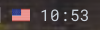

# fbxkb


X11 keyboard indicator and switcher.

It shows a flag of current keyboard in a systray area and allows
with a click to switch to another one.




## Usage

Edit `.xsession` (or `.xinitrc`) script to configure layouts and start `fbxkb`.
This example adds US English, German and Italian with both shifts switching.

```bash
setxkbmap -option grp:switch,grp:shifts_toggle,grp_led:scroll us,de,it
fbxkb &
```

## Building

```bash
sudo apt install libgtk2.0-dev
PREFIX=$HOME/.local ./configure
make
make install
```
